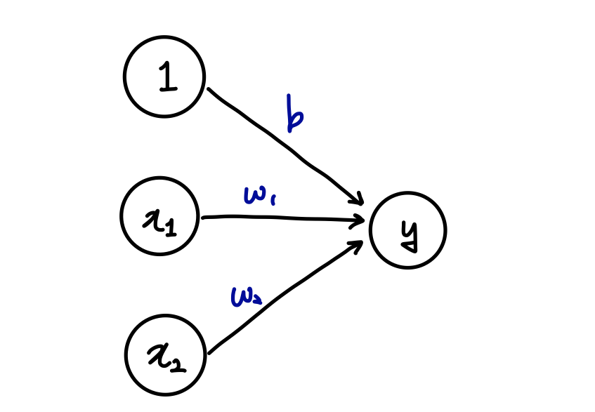
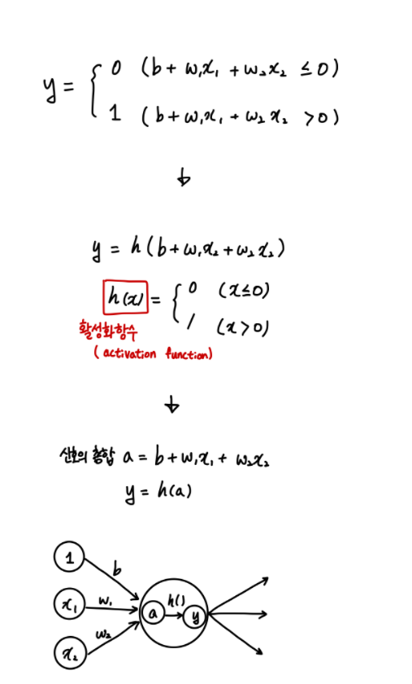

# 03. 신경망

신경망은 가중치 매개변수의 적절한 값을 데이터로부터 자동으로 학습하는 능력이 핵심이다.

## 3.1. 퍼셉트론과 신경망

### 3.1.1. 신경망

가장 기본적인 신경망의 구조이다.

### 3.1.2. 퍼셉트론

* 편향(b) : 뉴런이 얼마나 쉽게 활성화되느냐.
* 가중치(w) : 각 신호의 영향력을 제어.

### 3.1.3 활성화 함수

* 활성화 함수(activation function) : 입력 신호의 총합이 활성화를 일으키는지.

    일반적으로, **단순 퍼셉트론** 은 단층 네트워크에서 계단 함수를 활성화 함수로 사용한 모델을 가리키고 **다층 퍼셉트론** 은 신경망(여러 층으로 구성되고 시그모이드 함수 등의 매끈한 활성화 함수를 사용하는 네트워크)을 가리킵니다.
  
  
  
## 3.2. 활성화 함수
  
  
